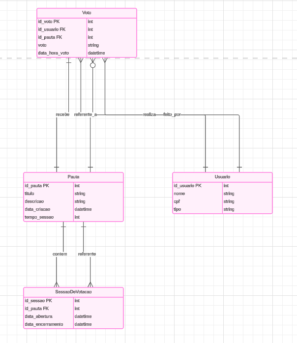

# desafioDB
No desafio vamos ter esse modelo de banco

As seguintes rotas
Pauta:
POST /api/pautas: Para cadastrar uma nova pauta.
GET /api/pautas: Para listar todas as pautas disponíveis.
GET /api/pautas/{id}: Para obter os detalhes de uma pauta específica.
GET /api/pautas/{id}/sessao: Para verificar se uma sessão de votação está aberta para uma pauta específica.
POST /api/pautas/{id}/sessao: Para abrir uma sessão de votação para uma pauta específica.
Votação:
POST /api/pautas/{id}/votos: Para registrar o voto de um usuário em uma pauta específica.
Usuário (Tarefa Bônus):
POST /api/usuarios: Para cadastrar um novo usuário.
GET /api/usuarios/{id}: Para obter os detalhes de um usuário específico.
PUT /api/usuarios/{id}: Para atualizar os detalhes de um usuário específico.
DELETE /api/usuarios/{id}: Para excluir um usuário específico (dependendo das necessidades do sistema).
Autenticação e Controle de Acesso (Tarefa Bônus):
POST /api/auth/login: Para autenticar um usuário e obter um token de acesso.
Rotas adicionais podem ser necessárias para autorização e controle de acesso, dependendo das regras específicas do sistema.